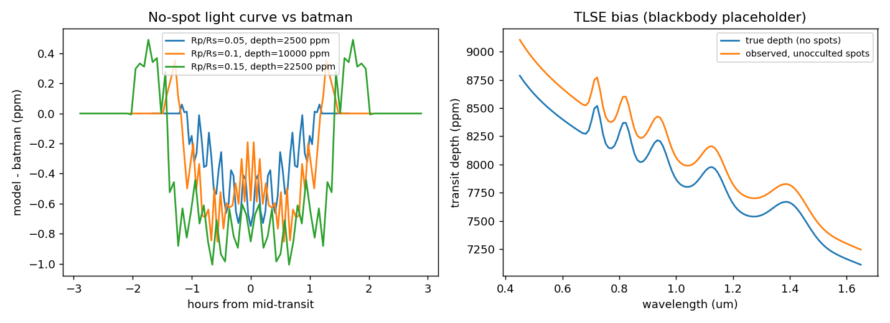

# Phase 1 validation report

Generated by `scripts/run_validation.py`. Stellar spectra here are blackbody placeholders,
so these checks validate the geometry and the algebra, not the realism of the spectra.

## Transit vs batman (no spots, pixel grid 1201 x 1201)

| Rp/Rs | a/Rs | inc (deg) | u1, u2 | depth (ppm) | max abs residual (ppm) | residual / depth |
| --- | --- | --- | --- | --- | --- | --- |
| 0.05 | 10 | 89 | 0.4, 0.25 | 2500 | 0.75 | 3.0e-04 |
| 0.1 | 8 | 87 | 0.5, 0.2 | 10000 | 0.85 | 8.5e-05 |
| 0.15 | 6 | 86 | 0.3, 0.3 | 22500 | 1.01 | 4.5e-05 |

## Unocculted limit vs analytic epsilon

Chromatic limb darkening, two spots and one facular region (one spot is on the far side), 120 wavelengths. Flux-weighted coverage
spot/faculae = 0.063/0.059. Largest relative difference between the pixel-model depth and
true depth x epsilon: **2.1e-14**. Peak epsilon = 1.0362.

## Not yet validated

- Realistic stellar atmosphere spectra. The conceptual version uses blackbodies; the grid interpolator is tested on a synthetic grid only.
- Pandora response curves (the band edges are published, but the Python bands are top hats).
- Any joint fit. The site uses a simplified visible-anchored correction instead; see the page 3 tests.
